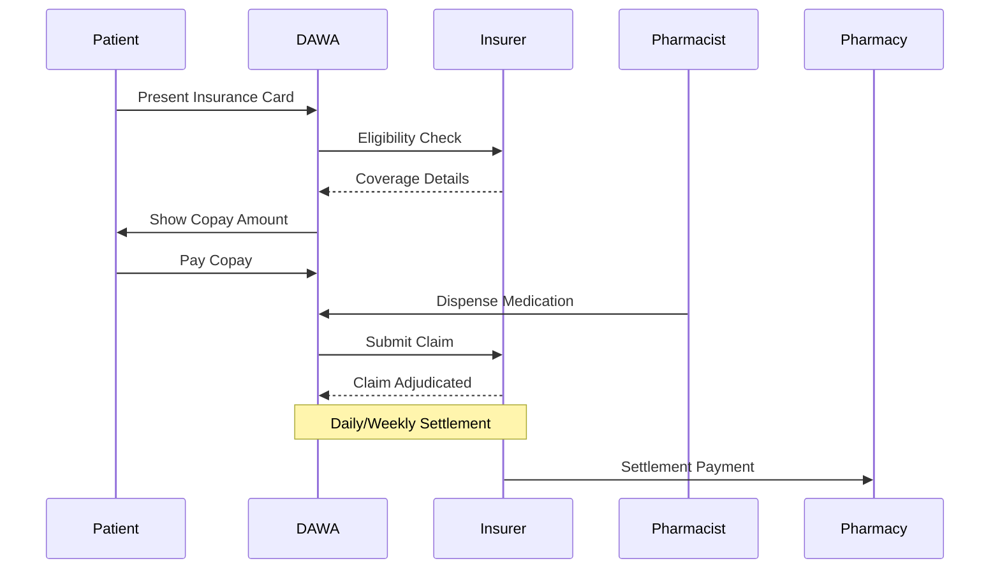

# PHASE 2: Claims Gateway (Months 7-9)

> **Objective**: Insurance Integration
> **Key Deliverables**: CNSS/CNOPS APIs, Claims Processing, Real-time Adjudication

## Prerequisites

✅ Phase 1 completed and validated
✅ 20+ pharmacies active
✅ 100+ orders completed
✅ Rx verification accuracy > 95%

## Overview

Phase 2 transforms DAWA into the insurance claims layer for Morocco, connecting pharmacies directly to CNSS (private sector) and CNOPS (public sector) for real-time eligibility and claims processing.

## Morocco Insurance Landscape

| Insurer | Beneficiaries | Coverage | Integration |
|---------|---------------|----------|-------------|
| CNSS | 3.5M private sector | 70% Rx | Direct API |
| CNOPS | 2.5M public sector | 80% Rx | Direct API |
| AMO | 11M+ universal | Variable | Gateway |
| RAMED | Low-income | 100% | Manual |
| Private (Saham, RMA) | ~2M | Variable | EDI/API |

## Claims Processing Flow



## Data Models

### insurance_members
```sql
CREATE TABLE insurance_members (
  id UUID PRIMARY KEY DEFAULT gen_random_uuid(),
  user_id UUID REFERENCES users(id) NOT NULL,
  insurer_code VARCHAR(20) NOT NULL, -- CNSS, CNOPS, etc.
  member_id VARCHAR(50) NOT NULL,
  policy_number VARCHAR(50),
  group_number VARCHAR(50),
  member_type VARCHAR(20), -- primary, dependent
  primary_member_id UUID REFERENCES insurance_members(id),
  relationship VARCHAR(20), -- self, spouse, child
  coverage_start_date DATE,
  coverage_end_date DATE,
  rx_coverage_percent DECIMAL(5, 2),
  deductible DECIMAL(10, 2) DEFAULT 0,
  deductible_met DECIMAL(10, 2) DEFAULT 0,
  annual_max DECIMAL(10, 2),
  annual_used DECIMAL(10, 2) DEFAULT 0,
  card_image_url TEXT,
  is_verified BOOLEAN DEFAULT false,
  verified_at TIMESTAMPTZ,
  is_active BOOLEAN DEFAULT true,
  created_at TIMESTAMPTZ DEFAULT now(),
  updated_at TIMESTAMPTZ DEFAULT now(),
  UNIQUE(insurer_code, member_id)
);
```

### claims
```sql
CREATE TABLE claims (
  id UUID PRIMARY KEY DEFAULT gen_random_uuid(),
  claim_number VARCHAR(30) UNIQUE NOT NULL,
  order_id UUID REFERENCES orders(id) NOT NULL,
  pharmacy_id UUID REFERENCES pharmacies(id) NOT NULL,
  patient_id UUID REFERENCES users(id) NOT NULL,
  insurance_member_id UUID REFERENCES insurance_members(id) NOT NULL,
  insurer_code VARCHAR(20) NOT NULL,
  
  -- Amounts
  billed_amount DECIMAL(10, 2) NOT NULL,
  covered_amount DECIMAL(10, 2),
  patient_copay DECIMAL(10, 2),
  deductible_applied DECIMAL(10, 2) DEFAULT 0,
  
  -- Status
  status VARCHAR(30) DEFAULT 'pending',
  -- pending, submitted, adjudicating, approved, denied, appealed, settled
  
  -- Submission
  submitted_at TIMESTAMPTZ,
  submission_reference VARCHAR(100),
  
  -- Adjudication
  adjudicated_at TIMESTAMPTZ,
  adjudication_code VARCHAR(20),
  adjudication_message TEXT,
  denial_reason VARCHAR(100),
  
  -- Settlement
  settlement_batch_id UUID,
  settled_at TIMESTAMPTZ,
  settlement_amount DECIMAL(10, 2),
  settlement_reference VARCHAR(100),
  
  -- Prior Auth
  requires_prior_auth BOOLEAN DEFAULT false,
  prior_auth_id UUID REFERENCES prior_authorizations(id),
  
  -- Audit
  raw_request JSONB,
  raw_response JSONB,
  
  created_at TIMESTAMPTZ DEFAULT now(),
  updated_at TIMESTAMPTZ DEFAULT now()
);

-- Indexes for claims processing
CREATE INDEX idx_claims_status ON claims(status);
CREATE INDEX idx_claims_insurer ON claims(insurer_code, status);
CREATE INDEX idx_claims_pharmacy ON claims(pharmacy_id, status);
CREATE INDEX idx_claims_settlement ON claims(settlement_batch_id);
```

### prior_authorizations
```sql
CREATE TABLE prior_authorizations (
  id UUID PRIMARY KEY DEFAULT gen_random_uuid(),
  pa_number VARCHAR(30) UNIQUE NOT NULL,
  patient_id UUID REFERENCES users(id) NOT NULL,
  insurance_member_id UUID REFERENCES insurance_members(id) NOT NULL,
  drug_id UUID REFERENCES drugs(id) NOT NULL,
  prescriber_name VARCHAR(255),
  prescriber_npi VARCHAR(20),
  diagnosis_code VARCHAR(10), -- ICD-10
  diagnosis_description TEXT,
  clinical_notes TEXT,
  quantity_requested INTEGER,
  days_supply INTEGER,
  status VARCHAR(30) DEFAULT 'pending',
  -- pending, approved, denied, expired
  approved_quantity INTEGER,
  approved_days_supply INTEGER,
  valid_from DATE,
  valid_until DATE,
  denial_reason TEXT,
  appeal_deadline DATE,
  created_at TIMESTAMPTZ DEFAULT now(),
  updated_at TIMESTAMPTZ DEFAULT now()
);
```

## API Integrations

### CNSS Integration
```typescript
interface CNSSEligibilityRequest {
  matricule: string;        // CNSS number
  cin: string;              // National ID
  dateNaissance: string;    // YYYY-MM-DD
}

interface CNSSEligibilityResponse {
  eligible: boolean;
  couverture: {
    tauxRemboursement: number;  // e.g., 0.70 for 70%
    plafondAnnuel: number;
    consomme: number;
    reste: number;
  };
  beneficiaire: {
    nom: string;
    prenom: string;
    type: 'assure' | 'conjoint' | 'enfant';
  };
  erreur?: {
    code: string;
    message: string;
  };
}

// CNSS API Client
class CNSSClient {
  private baseUrl = 'https://api.cnss.ma/v1';
  private apiKey: string;
  
  async checkEligibility(req: CNSSEligibilityRequest): Promise<CNSSEligibilityResponse> {
    const response = await fetch(`${this.baseUrl}/eligibilite`, {
      method: 'POST',
      headers: {
        'Authorization': `Bearer ${this.apiKey}`,
        'Content-Type': 'application/json',
      },
      body: JSON.stringify(req),
    });
    
    return response.json();
  }
  
  async submitClaim(claim: CNSSClaimRequest): Promise<CNSSClaimResponse> {
    // Similar implementation
  }
}
```

### CNOPS Integration
```typescript
interface CNOPSEligibilityRequest {
  ppr: string;              // Personnel number
  cin: string;
  dateNaissance: string;
}

// Similar structure to CNSS but different field names
// CNOPS uses XML SOAP (legacy), we wrap in REST adapter
```

## Real-Time Eligibility Check

```typescript
// Called when patient enters insurance info
async function checkEligibility(
  patientId: string,
  insurerCode: string,
  memberInfo: InsuranceMemberInput
): Promise<EligibilityResult> {
  // 1. Validate input
  const validated = InsuranceMemberSchema.parse(memberInfo);
  
  // 2. Route to correct insurer
  const client = getInsurerClient(insurerCode);
  
  // 3. Call insurer API
  const response = await client.checkEligibility({
    memberId: validated.memberId,
    cin: validated.nationalId,
    dateOfBirth: validated.dateOfBirth,
  });
  
  // 4. Store/update member record
  await upsertInsuranceMember({
    userId: patientId,
    insurerCode,
    ...response.beneficiaire,
    coveragePercent: response.couverture.tauxRemboursement,
    annualMax: response.couverture.plafondAnnuel,
    annualUsed: response.couverture.consomme,
  });
  
  // 5. Return result
  return {
    eligible: response.eligible,
    coveragePercent: response.couverture.tauxRemboursement,
    remainingBudget: response.couverture.reste,
  };
}
```

## Copay Calculation

```typescript
interface CopayCalculation {
  orderId: string;
  drugs: DrugWithPrice[];
  insuranceMember: InsuranceMember;
}

function calculateCopay(input: CopayCalculation): CopayResult {
  const { drugs, insuranceMember } = input;
  
  let totalBilled = 0;
  let totalCovered = 0;
  let totalCopay = 0;
  
  for (const drug of drugs) {
    const price = drug.quantity * drug.unitPrice;
    totalBilled += price;
    
    // Check if drug is covered
    if (!isDrugCovered(drug.id, insuranceMember.insurerCode)) {
      totalCopay += price;
      continue;
    }
    
    // Apply coverage percentage
    const covered = price * insuranceMember.coveragePercent;
    const copay = price - covered;
    
    totalCovered += covered;
    totalCopay += copay;
  }
  
  // Check against annual max
  if (totalCovered + insuranceMember.annualUsed > insuranceMember.annualMax) {
    const overMax = (totalCovered + insuranceMember.annualUsed) - insuranceMember.annualMax;
    totalCovered -= overMax;
    totalCopay += overMax;
  }
  
  return {
    totalBilled,
    totalCovered,
    totalCopay,
    breakdown: drugs.map(d => ({
      drugId: d.id,
      drugName: d.name,
      price: d.quantity * d.unitPrice,
      covered: /* per-drug calculation */,
      copay: /* per-drug calculation */,
    })),
  };
}
```

## Claims Dashboard (Pharmacy Portal)

### Views

1. **Pending Claims**
   - Claims awaiting submission
   - Batch submission action
   
2. **In Progress**
   - Submitted, awaiting adjudication
   - Real-time status updates

3. **Approved**
   - Ready for settlement
   - Settlement batch tracking

4. **Denied**
   - Denial reasons
   - Appeal workflow
   - Resubmission actions

5. **Settled**
   - Payment received
   - Remittance details
   - Reconciliation tools

### Analytics
```typescript
interface ClaimsAnalytics {
  // Volume
  claimsSubmitted: number;
  claimsApproved: number;
  claimsDenied: number;
  approvalRate: number;
  
  // Financial
  totalBilled: number;
  totalSettled: number;
  pendingSettlement: number;
  averageDaysToSettle: number;
  
  // Denial Analysis
  denialsByReason: Record<string, number>;
  topDeniedDrugs: DrugDenialStat[];
  
  // Insurer Breakdown
  byInsurer: Record<string, InsurerStats>;
}
```

## Settlement Processing

```typescript
// Daily batch settlement job
async function processSettlements(): Promise<void> {
  const insurers = ['CNSS', 'CNOPS', /* others */];
  
  for (const insurer of insurers) {
    // 1. Get approved claims ready for settlement
    const claims = await getApprovedClaims(insurer);
    
    if (claims.length === 0) continue;
    
    // 2. Create settlement batch
    const batch = await createSettlementBatch({
      insurerCode: insurer,
      claimIds: claims.map(c => c.id),
      totalAmount: claims.reduce((sum, c) => sum + c.covered_amount, 0),
    });
    
    // 3. Submit to insurer (if required)
    await submitSettlementBatch(insurer, batch);
    
    // 4. Update claims
    await markClaimsAsSettling(claims.map(c => c.id), batch.id);
  }
}

// Webhook/polling for settlement confirmation
async function handleSettlementConfirmation(
  batchId: string,
  settlementReference: string,
  amount: number
): Promise<void> {
  const batch = await getSettlementBatch(batchId);
  
  // Update batch
  await updateSettlementBatch(batchId, {
    status: 'settled',
    settledAt: new Date(),
    settlementReference,
    settlementAmount: amount,
  });
  
  // Update all claims in batch
  await markClaimsAsSettled(batch.claimIds, settlementReference);
  
  // Credit pharmacy account
  await creditPharmacyAccount(batch.pharmacyId, amount, {
    type: 'insurance_settlement',
    reference: settlementReference,
  });
}
```

## Insurance Card Wallet (Patient App)

### Features
- Add/remove insurance cards
- Card image upload (OCR extraction)
- Family member cards
- Coverage summary
- Claims history

### UI
```typescript
interface InsuranceWalletScreen {
  primaryCard: InsuranceCard | null;
  dependentCards: InsuranceCard[];
  
  // Actions
  addCard: () => void;
  removeCard: (id: string) => void;
  setAsPrimary: (id: string) => void;
  viewClaimsHistory: () => void;
}
```

## Validation Checklist

Before proceeding to Phase 3:

- [ ] CNSS sandbox integration working
- [ ] CNOPS sandbox integration working
- [ ] Real-time eligibility < 500ms
- [ ] Copay calculation accurate
- [ ] Claims submission working
- [ ] Claims dashboard functional
- [ ] Denial handling workflow
- [ ] Settlement processing automated
- [ ] Insurance wallet in patient app
- [ ] Prior authorization workflow
- [ ] Claims adjudication accuracy > 98%
- [ ] 100+ claims processed in sandbox

## Prompt Sequence

Execute these prompts in order:

1. `prompts/phase-2/P2.1-insurance-model.md`
2. `prompts/phase-2/P2.2-cnss-api.md`
3. `prompts/phase-2/P2.3-cnops-api.md`
4. `prompts/phase-2/P2.4-eligibility.md`
5. `prompts/phase-2/P2.5-copay.md`
6. `prompts/phase-2/P2.6-claims-submit.md`
7. `prompts/phase-2/P2.7-claims-dashboard.md`
8. `prompts/phase-2/P2.8-settlement.md`
9. `prompts/phase-2/P2.9-wallet.md`
10. `prompts/phase-2/P2.10-prior-auth.md`

---

*Completion of Phase 2 unlocks Phase 3: B2B Marketplace*
